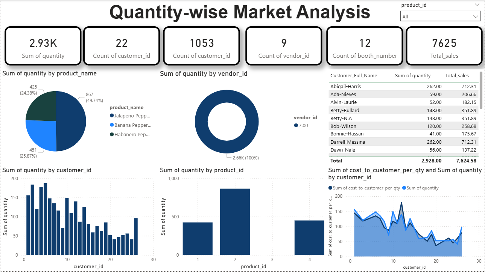

# PowerBI_demo1

## 📌 Overview
This repository contains a Power BI (.pbix) dashboard file designed to analyze and visualize business data effectively. The report focuses on transforming raw data into meaningful insights using interactive dashboards, calculated columns, and DAX measures.

## 🚀 Features
- Data Cleaning & Transformation using Power Query
- Custom DAX Measures & Calculated Columns
- Interactive Visualizations
- Dynamic Filtering & Slicers
- KPI Cards and Trend Analysis
- Date Formatting & Time-based Analysis
- Conditional Logic & Data Modeling
  
## 🛠 Tools & Technologies
- Power BI Desktop
- Power Query (M Language)
- DAX (Data Analysis Expressions)
- Data Modeling & Relationships

## 📂 File Included
.pbix file containing the complete dashboard and data model

## 📈 Key Insights Generated
- Sales / Performance trends over time
- Category-wise analysis
- Data normalization and formatting handling (multiple date formats, text cleaning, etc.)
- Custom business logic implementation

## 🎯 Purpose
This project demonstrates practical data analytics skills including:
- Data preprocessing
- Data modeling
- Visualization best practices
- Business insight generation
  
# Dashboard
